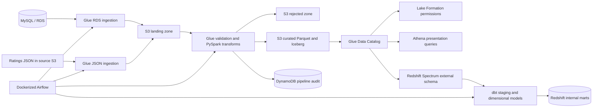

# AWS Medallion Lakehouse

This repository is a reconstructed and enhanced version of the original
`medallion-lakehouse-with-aws-lake-formation` project.


## Important architecture distinction

S3 and Iceberg are the persistent lakehouse storage. Redshift Spectrum reads the
curated external tables from S3 through the Glue Data Catalog. dbt then creates
analytics-ready fact and dimension tables inside Redshift, which becomes the
serving warehouse for BI and downstream SQL consumers.

## High-level flow



## Data model

The source domain is the Classic Models sales database plus product ratings.
The main dbt serving models are:

- `dim_customers`
- `dim_products`
- `dim_date`
- `fact_order_items`
- `fact_product_ratings`
- `mart_monthly_sales`
- `mart_product_performance`

A **fact table** stores measurable business events such as order lines or
ratings. A **dimension table** stores descriptive context such as customer,
product, or date attributes.

## Repository layout

```text
.
|-- airflow/                  Docker image, dependencies and DAG
|-- dbt/                      Spectrum sources and Redshift star schema
|-- docs/                     Folder revision guide and interview Q&A
|-- presentation_sql/         Athena Iceberg presentation tables
|-- scripts/                  Manual runner and Redshift bootstrap utilities
|-- terraform/                AWS infrastructure and Glue job code
|-- docker-compose.yml        Local Airflow runtime
`-- Makefile                  Common commands
```


## Deployment order

1. Copy `terraform/terraform.tfvars.example` to `terraform/terraform.tfvars`.
2. Set globally unique bucket names and source/network values.
3. Run `terraform init`, `terraform plan`, and `terraform apply`.
4. Run `python scripts/bootstrap_redshift.py` when Redshift is enabled.
5. Copy `airflow/.env.example` to `airflow/.env`.
6. Start Airflow with `docker compose up airflow-init` and then
   `docker compose up -d`.
7. Set `ENABLE_REDSHIFT=true` in `airflow/.env` only after Redshift and the
   Spectrum external schema are ready; otherwise the DAG safely skips dbt.
8. Trigger the `medallion_lakehouse` DAG with a processing date.
9. After the runtime-created `presentation_zone.ratings_for_ml` table exists,
   optionally set `enable_downstream_access=true` and apply again.

## Cost warning

Redshift Serverless, Glue jobs, Athena queries and NAT/network components can
create AWS charges. Redshift is disabled by default in Terraform. Review the
plan and enable only the resources you intend to run.
